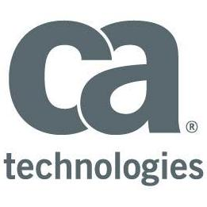
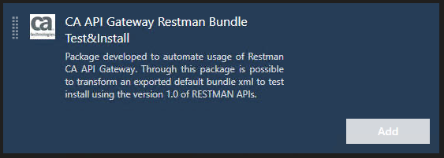
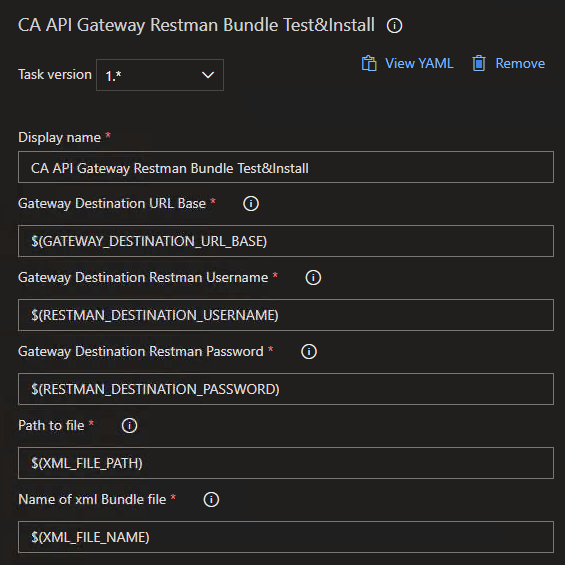

<!-- [![Contributors][contributors-shield]][contributors-url] -->
<!-- [![Forks][forks-shield]][forks-url] -->
<!-- [![Stargazers][stars-shield]][stars-url] -->
<!-- [![MIT License][license-shield]][license-url] -->
[![Issues][issues-shield]][issues-url][![LinkedIn][linkedin-shield]][linkedin-url]

<!-- PROJECT LOGO -->
 

  

  <h3 align="center">CA API Gateway Restman Bundle Test&Install</h3>

  

    Package developed to automate usage of Restman CA API Gateway. Through this package is possible to transform an exported default bundle xml to test install using the version 1.0 of RESTMAN APIs.
    
  

<!-- TABLE OF CONTENTS -->

  
Table of Contents

  <ol>
    <li>
      <a href="#about-the-project">About The Project</a>
      <ul>
        <li><a href="#built-with">Built With</a></li>
      </ul>
    </li>
    <li>
      <a href="#getting-started">Getting Started</a>
      <ul>
        <li><a href="#prerequisites">Prerequisites</a></li>
        <li><a href="#installation">Installation</a></li>
      </ul>
    </li>
    <li><a href="#usage">Usage</a></li>
    <!-- <li><a href="#roadmap">Roadmap</a></li> -->
    <!-- <li><a href="#contributing">Contributing</a></li> -->
    <li><a href="#license">License</a></li>
    <li><a href="#contact">Contact</a></li>
    <!-- <li><a href="#acknowledgements">Acknowledgements</a></li> -->
  </ol>

<!-- ABOUT THE PROJECT -->
## About The Project

This package was developed to automate usage of Restman CA API Gateway. Through this package is possible to transform an exported default bundle xml to test install using the version 1.0 of RESTMAN APIs.

A list of commonly used resources that I find helpful are listed in the acknowledgements.

### Built With

* [NodeJS](https://nodejs.org/en/download/)
* [TypeScript](https://www.typescriptlang.org/)
* [Axios](https://www.npmjs.com/package/axios#installing)

<!-- GETTING STARTED -->
## Getting Started

### Prerequisites

Please, check the Prerequisites section of Microsoft VSTS Tasks documentation [Add a custom pipelines task extension - Prerequisites](https://docs.microsoft.com/en-us/azure/devops/extend/develop/add-build-task?view=azure-devops#prerequisites)

<!-- USAGE EXAMPLES -->
## Usage
To local run follow these steps

1. cd to package.json and install (`cd ca-gateway-restman-vsts-task`)
2. `npm install`
3. `tsc --build`
4. Define environment variables
   1. export INPUT_gatewayDestinationUrlBase=value
   2. export INPUT_gatewayRestmanDestinationUsername=value
   3. export INPUT_gatewayRestmanDestinationPassword=value
   4. export INPUT_filePath=value
   5. export INPUT_xmlFileName=value
5. Place a RAW and valid exported Bundle XML containing your policies at the filePath/xmlFileName
6. Run the task `node ./index.js`

<!-- ROADMAP -->
<!-- ## Roadmap

See the [open issues](https://github.com/othneildrew/Best-README-Template/issues) for a list of proposed features (and known issues). -->

<!-- CONTRIBUTING -->
## Contributing

Contributions are what make the open source community such an amazing place to be learn, inspire, and create. Any contributions you make are **greatly appreciated**.

1. Fork the Project
2. Create your Feature Branch (`git checkout -b feature/AmazingFeature`)
3. Commit your Changes (`git commit -m 'Add some AmazingFeature'`)
4. Push to the Branch (`git push origin feature/AmazingFeature`)
5. Open a Pull Request

<!-- LICENSE -->
<!-- ## License

Distributed under the MIT License. See `LICENSE` for more information. -->

<!-- CONTACT -->
## Contact

Lucas Marçoni - [Linkedin](https://www.linkedin.com/in/lucasfmarconi/)

<!-- Project Link: [https://github.com/lucasfmarconi/ca-gateway-restman-vsts-task](https://github.com/lucasfmarconi/ca-gateway-restman-vsts-task) -->

<!-- ACKNOWLEDGEMENTS -->
<!-- ## Acknowledgements
* [GitHub Emoji Cheat Sheet](https://www.webpagefx.com/tools/emoji-cheat-sheet)
* [Img Shields](https://shields.io)
* [Choose an Open Source License](https://choosealicense.com)
* [GitHub Pages](https://pages.github.com)
* [Animate.css](https://daneden.github.io/animate.css)
* [Loaders.css](https://connoratherton.com/loaders)
* [Slick Carousel](https://kenwheeler.github.io/slick)
* [Smooth Scroll](https://github.com/cferdinandi/smooth-scroll)
* [Sticky Kit](http://leafo.net/sticky-kit)
* [JVectorMap](http://jvectormap.com)
* [Font Awesome](https://fontawesome.com) -->

<!-- MARKDOWN LINKS & IMAGES -->
<!-- https://www.markdownguide.org/basic-syntax/#reference-style-links -->
[contributors-shield]: https://img.shields.io/github/contributors/othneildrew/Best-README-Template.svg?style=for-the-badge
[contributors-url]: https://github.com/othneildrew/Best-README-Template/graphs/contributors
[forks-shield]: https://img.shields.io/github/forks/othneildrew/Best-README-Template.svg?style=for-the-badge
[forks-url]: https://github.com/othneildrew/Best-README-Template/network/members
[stars-shield]: https://img.shields.io/github/stars/othneildrew/Best-README-Template.svg?style=for-the-badge
[stars-url]: https://github.com/othneildrew/Best-README-Template/stargazers
[issues-shield]: https://img.shields.io/github/issues/othneildrew/Best-README-Template.svg?style=for-the-badge
[issues-url]: https://github.com/othneildrew/Best-README-Template/issues
[license-shield]: https://img.shields.io/github/license/othneildrew/Best-README-Template.svg?style=for-the-badge
[license-url]: https://github.com/othneildrew/Best-README-Template/blob/master/LICENSE.txt
[linkedin-shield]: https://img.shields.io/badge/-LinkedIn-black.svg?style=for-the-badge&logo=linkedin&colorB=555
[linkedin-url]: https://linkedin.com/in/othneildrew
[product-screenshot]: images/screenshot.png